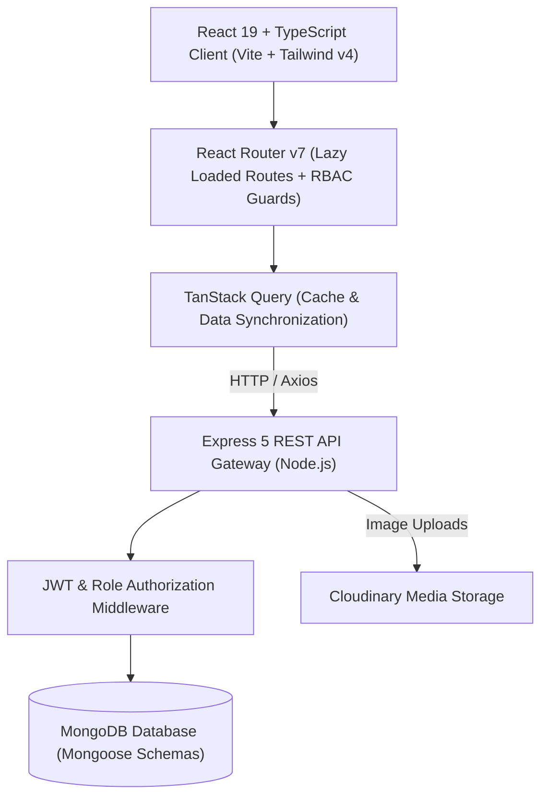

<div align="center">

# 📦 Product & Inventory Management System (ERP)

An enterprise-grade, full-stack **Product & Inventory Management ERP System** built on the modern MERN stack with TypeScript, Tailwind CSS v4, Framer Motion, and Role-Based Access Control (RBAC).

[](https://mern-project1front.vercel.app/)
[](https://react.dev/)
[](https://www.typescriptlang.org/)
[](https://nodejs.org/)
[](https://expressjs.com/)
[](https://www.mongodb.com/)
[](https://tailwindcss.com/)
[](LICENSE)

[Live Application](https://mern-project1front.vercel.app/) • [Report Bug](https://github.com/peymanbabayev/product-management-system/issues) • [Request Feature](https://github.com/peymanbabayev/product-management-system/issues)

</div>

---

## 📑 Table of Contents

- [Overview](#-overview)
- [Key Features](#-key-features)
- [Live Demo & Test Credentials](#-live-demo--test-credentials)
- [System Architecture](#-system-architecture)
- [Tech Stack](#-tech-stack)
- [Project Structure](#-project-structure)
- [Getting Started](#-getting-started)
  - [Prerequisites](#prerequisites)
  - [Installation & Local Setup](#installation--local-setup)
  - [Environment Variables](#environment-variables)
  - [Database Seeding](#database-seeding)
- [API Documentation](#-api-documentation)
- [Security & Authentication](#-security--authentication)
- [Deployment](#-deployment)
- [Contributing](#-contributing)
- [License](#-license)
- [Author](#-author)

---

## 🌟 Overview

The **Product & Inventory Management System (ERP)** is designed to streamline end-to-end supply chain operations, warehouse logistics, product catalog lifecycle, counterparty (Kontragent) relationships, financial ledgers, and team workflow management in a single intuitive platform.

Built with a performant client-side architecture powered by **Vite + React 19 + TanStack Query** and a robust **Express 5 + MongoDB** backend API, the application features role-based access management, company data isolation, interactive onboarding tours, and real-time inventory analytics.

---

## 🚀 Key Features

### 1. 📊 Executive Dashboard & Analytics
- **KPI Metrics**: Real-time revenue, expense, total inventory valuation, and active stock counts.
- **Visual Charts**: Interactive revenue vs. expense trends, top-selling categories, and warehouse utilization metrics.
- **Activity Log**: Real-time audit trail capturing all critical system actions.

### 2. 📦 Product & Catalog Management
- **Full CRUD Operations**: Create, edit, search, filter, and categorize products with SKU tracking.
- **Stock Threshold Alerts**: Automated low-stock visual badges and replenishment notifications.
- **Cloudinary Integration**: High-performance multi-format media uploads with automatic optimization.
- **Favorites & Quick Actions**: Bookmark high-demand products for rapid access.

### 3. 🏭 Warehouse & Stock Movements
- **Multi-Warehouse Support**: Manage multiple storage facilities and locations.
- **Stock Movement Ledger**: Track incoming shipments, outgoing orders, internal warehouse transfers, and write-offs.
- **Capacity Monitoring**: Visual indicators for storage capacity and stock distribution.

### 4. 🤝 Kontragents / Counterparty CRM
- **Suppliers & Customers**: Centralized directory with contact details, tax numbers (VÖEN), and contract terms.
- **Debt & Balance Tracking**: Dynamic calculation of accounts payable and accounts receivable.
- **Transaction History**: Instant drill-down into all deals linked to specific counterparties.

### 5. 💰 Financial Ledger & Transactions
- **Income & Expense Tracking**: Comprehensive financial transaction log categorized by type and payment method (Cash, Card, Bank Transfer).
- **Invoice & Reference Linking**: Attach transactions directly to products, warehouses, or kontragents.

### 6. 📋 Tasks & Workflow Management
- **Team Task Board**: Assign priorities (Low, Medium, High, Urgent), deadlines, and status stages.
- **Role Assignment**: Delegate responsibilities across team members with automated status updates.

### 7. 🛡️ Role-Based Access Control (RBAC) & Multi-Tenancy
- **Granular Roles**: `Owner`, `Admin`, `Accountant`, `Sales Manager`, `Purchasing`, `Warehouse`, `Viewer`.
- **Company Isolation**: Strict data segregation per company account to guarantee multi-tenant privacy.
- **User Approval Pipeline**: Admin verification flow for newly registered accounts.

### 8. 🧭 Guided Onboarding & UX
- **Interactive Tour**: Step-by-step guided walkthrough built with `react-joyride` to onboard new users.
- **Responsive & Modern UI**: Smooth micro-interactions via `framer-motion`, custom Tailwind CSS v4 styling, and accessible Radix UI primitives.

---

## 🔑 Live Demo & Test Credentials

🌐 **Live URL**: [https://mern-project1front.vercel.app/](https://mern-project1front.vercel.app/)

Feel free to log in with any of the pre-configured demo roles below:

| Role | Email | Password | Access Level |
| :--- | :--- | :--- | :--- |
| **Owner (Full Access)** | `owner@demo.com` | `password123` | Full access across all modules & settings |
| **Accountant** | `accountant@demo.com` | `password123` | Financial transactions, products, kontragents |
| **Sales Manager** | `manager@demo.com` | `password123` | Sales orders, customer relations, product catalog |
| **Warehouse Lead** | `warehouse@demo.com` | `password123` | Warehouse stock, inventory movements |
| **Viewer (Read Only)** | `viewer@demo.com` | `password123` | Read-only access to dashboard and catalog |

---

## 🏗️ System Architecture



---

## 💻 Tech Stack

### Frontend
| Technology | Description |
| :--- | :--- |
| **React 19** | Modern declarative UI library |
| **TypeScript** | Type-safe enterprise JavaScript |
| **Vite 7** | Next-generation frontend build tool |
| **Tailwind CSS v4** | Modern utility-first styling engine |
| **TanStack React Query v5** | Server-state caching and asynchronous data synchronization |
| **React Router v7** | Declarative client-side routing & protected layout hierarchies |
| **Framer Motion** | Production-ready motion and gesture library |
| **Radix UI** | Unstyled, accessible UI components |
| **Lucide Icons** | Consistent, modern vector iconography |
| **React Joyride** | Interactive user onboarding walkthroughs |

### Backend
| Technology | Description |
| :--- | :--- |
| **Node.js (ES Modules)** | Asynchronous event-driven JavaScript runtime |
| **Express 5** | High-performance, minimalist REST API framework |
| **MongoDB & Mongoose 9** | NoSQL document database with typed schema modeling |
| **JSON Web Tokens (JWT)** | Stateless authentication with signed tokens |
| **Bcrypt.js** | Salted password hashing algorithms |
| **Multer & Cloudinary** | Multipart image parsing and cloud media delivery |

---

## 📁 Project Structure

```
mern_project1/
├── client/                     # Frontend Application (React 19 + Vite)
│   ├── public/                 # Static public assets
│   ├── src/
│   │   ├── assets/             # Images, SVG icons, static media
│   │   ├── components/         # Reusable UI primitives (Radix UI / Custom)
│   │   ├── config/             # App & API endpoint configurations
│   │   ├── context/            # Global React contexts (Auth, Theme)
│   │   ├── layouts/            # DashboardLayout, AuthLayout
│   │   ├── lib/                # Utility helpers (cn, formatters)
│   │   ├── pages/              # View pages (Dashboard, Products, Warehouses, etc.)
│   │   ├── router/             # React Router route definitions & RBAC guards
│   │   ├── services/           # Axios/Fetch API service modules
│   │   └── utils/              # Data parsing, currency and date utilities
│   ├── package.json
│   ├── tailwind.config.js
│   └── vite.config.ts
│
├── server/                     # Backend API (Express 5 + Mongoose)
│   ├── seed/                   # Database seed scripts for demo accounts
│   ├── src/
│   │   ├── config/             # Database connection & Cloudinary setup
│   │   ├── controllers/        # Route handler functions (Business logic)
│   │   ├── middleware/         # Auth verification, error handling, file upload
│   │   ├── models/             # Mongoose schemas (User, Product, Warehouse, etc.)
│   │   ├── routes/             # Express API routes
│   │   ├── scripts/            # Database migration and utility scripts
│   │   └── server.js           # Server entrypoint and Express middleware chain
│   └── package.json
│
├── .github/                    # GitHub Workflows & Issue / PR Templates
├── package.json                # Root package.json with concurrent dev scripts
└── README.md
```

---

## 🛠️ Getting Started

### Prerequisites
Make sure you have the following installed on your local development machine:
- **Node.js** `>= 20.x`
- **npm** `>= 10.x` (or `yarn` / `pnpm`)
- **MongoDB** (Local instance or [MongoDB Atlas URI](https://www.mongodb.com/atlas))

---

### Installation & Local Setup

1. **Clone the repository**:
   ```bash
   git clone https://github.com/peymanbabayev/product-management-system.git
   cd product-management-system
   ```

2. **Install all dependencies** (Root, Client, and Server):
   ```bash
   # Install root dependencies
   npm install

   # Install client dependencies
   cd client && npm install

   # Install server dependencies
   cd ../server && npm install

   # Return to root
   cd ..
   ```

3. **Configure Environment Variables**:
   Create `.env` files in both `server/` and `client/` directories based on the provided examples.

   **Server (`server/.env`)**:
   ```env
   NODE_ENV=development
   PORT=5000
   MONGO_URL=mongodb://localhost:27017/product_management
   CLIENT_URL=http://localhost:5173
   JWT_SECRET=your_super_secret_jwt_key_here
   JWT_EXPIRES_IN=7d
   API_VERSION=v1

   # Cloudinary (Optional for cloud image storage)
   CLOUDINARY_CLOUD_NAME=your_cloud_name
   CLOUDINARY_API_KEY=your_api_key
   CLOUDINARY_API_SECRET=your_api_secret
   ```

   **Client (`client/.env.development`)**:
   ```env
   VITE_API_URL=http://localhost:5000/api
   ```

4. **Seed the Database with Demo Accounts**:
   ```bash
   cd server
   npm run seed:demo
   cd ..
   ```

5. **Start the Development Servers**:
   You can run both client and server concurrently from the root directory:
   ```bash
   npm run dev
   ```

   - **Frontend App**: `http://localhost:5173`
   - **Backend API**: `http://localhost:5000`

---

## 📡 API Documentation

### Authentication & Users
| Method | Endpoint | Description | Auth Required |
| :--- | :--- | :--- | :--- |
| `POST` | `/api/v1/auth/register` | Register a new user and company account | No |
| `POST` | `/api/v1/auth/login` | Authenticate user & retrieve JWT token | No |
| `GET` | `/api/v1/users/me` | Fetch currently authenticated user profile | Yes |
| `GET` | `/api/v1/users` | List all users (Admin only) | Yes (Admin) |
| `PATCH` | `/api/v1/users/:id/status` | Approve or suspend user access | Yes (Admin) |

### Products & Inventory
| Method | Endpoint | Description | Auth Required |
| :--- | :--- | :--- | :--- |
| `GET` | `/api/v1/products` | Fetch all products with filter & pagination | Yes |
| `POST` | `/api/v1/products` | Create a new product with image upload | Yes |
| `GET` | `/api/v1/products/:id` | Get specific product details by ID | Yes |
| `PUT` | `/api/v1/products/:id` | Update product information and stock levels | Yes |
| `DELETE` | `/api/v1/products/:id` | Remove a product from inventory | Yes (Admin) |

### Warehouses & Stock Movements
| Method | Endpoint | Description | Auth Required |
| :--- | :--- | :--- | :--- |
| `GET` | `/api/v1/warehouses` | List all warehouses and capacity data | Yes |
| `POST` | `/api/v1/warehouses` | Create a new storage facility | Yes |
| `GET` | `/api/v1/warehouses/:id` | Retrieve specific warehouse analytics | Yes |

### Kontragents & Counterparties
| Method | Endpoint | Description | Auth Required |
| :--- | :--- | :--- | :--- |
| `GET` | `/api/v1/kontragents` | Retrieve suppliers & customers | Yes |
| `POST` | `/api/v1/kontragents` | Create counterparty entry | Yes |
| `PUT` | `/api/v1/kontragents/:id`| Update balance, contact, or company status | Yes |

### Financial Transactions & Tasks
| Method | Endpoint | Description | Auth Required |
| :--- | :--- | :--- | :--- |
| `GET` | `/api/v1/transactions` | Query income / expense records | Yes |
| `POST` | `/api/v1/transactions` | Record new transaction entry | Yes |
| `GET` | `/api/v1/tasks` | Get task list with status & deadlines | Yes |
| `POST` | `/api/v1/tasks` | Create and assign a task | Yes |

---

## 🔒 Security & Authentication

- **JWT Stateless Token Auth**: Tokens are cryptographically signed and validated across all protected API routes.
- **Password Protection**: Multi-round `bcryptjs` hashing with salt rounds.
- **CORS Protection**: Whitelisted origin control between frontend client and backend microservices.
- **Input Sanitization**: Mongoose schema casting and validation to prevent injection vectors.

---

## 🚀 Deployment

### Frontend (Vercel)
The client is optimized for zero-config deployment on Vercel:
1. Import repository on [Vercel](https://vercel.com).
2. Set Root Directory to `client`.
3. Set Framework Preset to `Vite`.
4. Configure Environment Variables: `VITE_API_URL`.

### Backend (Render / Railway)
1. Set Root Directory to `server`.
2. Build Command: `npm install`.
3. Start Command: `npm start`.
4. Add all server environment variables (`MONGO_URL`, `JWT_SECRET`, `CLIENT_URL`, etc.).

---

## 🤝 Contributing

Contributions, issues, and feature requests are welcome!

1. Fork the Project
2. Create your Feature Branch (`git checkout -b feature/AmazingFeature`)
3. Commit your Changes (`git commit -m 'Add some AmazingFeature'`)
4. Push to the Branch (`git push origin feature/AmazingFeature`)
5. Open a Pull Request

Please review our [Contributing Guidelines](CONTRIBUTING.md) for full details.

---

## 📄 License

Distributed under the **MIT License**. See [`LICENSE`](LICENSE) for more information.

---

## 👤 Author

**Peyman Babayev**
- GitHub: [@peymanbabayev](https://github.com/peymanbabayev)
- Repository: [product-management-system](https://github.com/peymanbabayev/product-management-system)

<div align="center">
  <sub>Built with ❤️ by Peyman Babayev</sub>
</div>